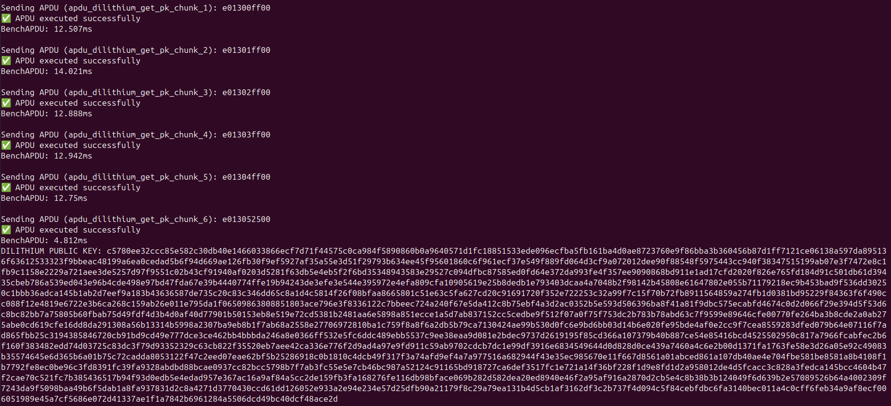
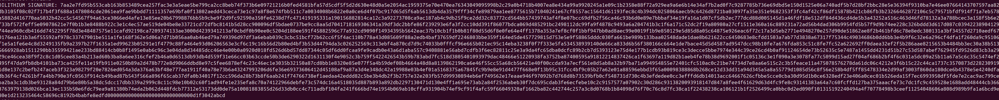

#  ZKN-PRIVACYHW

Tools to protect the private element from malware with a hardware wallet when signing using eddsa-poseidon over baby-jujub curve.

**WARNING: Nothing is audited, code is closed and some secrets elements are hardcoded, only use on a empty developer nano, or get drained. This code is delivered for PoC only.**

## AVAILABLE APPS

Three apps are available in the repo for now:

- EDDSAPOSEIDON
- DILITHIUM
- ETHDILITHIUM

## SIDELOADING THE APP

First ledger blue is required.

```
pip3 install ledgerblue
```

then to side load the app, just run the following command (here for nano Splus):

```
python3 -m ledgerblue.loadApp --targetId 0x33100004 --targetVersion="" --apiLevel 22 --fileName nanosp/app.hex --appName "ZKNOXHW" --appFlags 0x0 --delete --tlv --dataSize $((0x`cat debug/app.map | grep _envram_data | tr -s ' ' | cut -f2 -d' ' |cut -f2 -d'x' ` - 0x`cat debug/app.map | grep _nvram_data | tr -s ' ' | cut -f2 -d' ' | cut -f2 -d'x'`)) --installparamsSize $((0x`cat debug/app.map | grep _einstall_parameters | tr -s ' ' | cut -f2 -d' ' |cut -f2 -d'x'` - 0x`cat debug/app.map | grep _install_parameters | tr -s ' ' | cut -f2 -d' ' |cut -f2 -d'x'`))

```

Then verify the displayed hash is as expected (in case you didn't read first warning), this is displayed during installation as "Identifier" of the app.


dilithium: 81e7f731913b013c49de598bfe471ad5fc57af004d15c5d33de160c851eca5b5

ethdilithium: 8407bd17ed3ae26c74f4634bd68deb0e7d1d1b5c5133562f9062ad664cb7b794

eddsaposeidon: 00de7911c076d3e4f6180de947af6bb2950722f3afe5729326d3ce3fe26c164a

## SENDING COMMAND TO THE LEDGER DEVICE

### INSTALL TRANSPORT PACKAGE
The ledger hid transport package is required

```
npm install @ledgerhq/hw-transport-node-hid
```

To execute the required function, refer to the related APDU. The provided ledger_apdu.js illustrate how to send a command and read the result using the  @ledgerhq/hw-transport-node-hid package. Dedicated javascript is provided to illustrate each function.

### JAVASCRIPT

The javascript of the repo provides working example, which is helpful to understand the communication with the device.

- The ledger-apdu.js file enable to launch arbitrary APDUs to the device.
- eddsa_apdugencheck.js provide proof of compliance between circomlibjs and the app:
    - it generates a random private key, message, then
        - derivate the corresponding public key and signature of message by the private key with circomlibjs
        - verify consistency of the signature/verification process
        - send the corresponding APDU to ledger device
        - ensure circomlibjs and Ledger device output are equal 
- dilithium.js provides an example of signing/extracting signature and public key. The message is given as argument of the command line. Expected format is hexadecimal (4 bits per digit, from 0 to f).

```
node dilithium-apdu.js "abcd"
```

## APDUS

An APDU is a byte sequence send to the Ledger device to execute the required function. This section describes each APDU for the provided Apps.

## EDDSA POSEIDON

The private key is currently passed in the signing command, the aim is only to prove the concept, it actually doesn't provide more security for now. The next step will be to implement a BIP32 derivation.

### EDDSA-POSEIDON-SIGN

Sign using RFC8032 EDDSA algorithm, adapted to work over babyjujub curve with poseidon5 hash. Use the following 6 bytes prefix, followed by private key and message, each defined over 32 bytes.

```
e00c00004102 | prv(32) | msg(32)
```

## DILITHIUM &ETHDILITHIUM (EIP8051)

The keygen actually uses a hardcoded private key, every nano uses the same for now. (see warning).

The code is compliant with the python reference code (ethdilithium) and NIST KATS (for dilithium) of ZKNOXHQ [ETHDILITHIUM](https://github.com/ZKNoxHQ/ETHDILITHIUM/tree/main/src) repository.

### DILITHIUM GETKEY

Get the public key stored in the device.
Chunks 1 to 5:
```
e012|chunknumber(1)|ff00
```
Last chunk:
```
e013052500
```

```
  // Get public key
    // Build APDU list for retrieving public key of 1312 bytes: 0xff * 5 + 0x25 
    const apdus3 = [];
    apdus3.push({ name: "apdu_dilithium_get_pk_chunk_1", command: "e01300ff00" });
    apdus3.push({ name: "apdu_dilithium_get_pk_chunk_2", command: "e01301ff00" });
    apdus3.push({ name: "apdu_dilithium_get_pk_chunk_3", command: "e01302ff00" });
    apdus3.push({ name: "apdu_dilithium_get_pk_chunk_4", command: "e01303ff00" });
    apdus3.push({ name: "apdu_dilithium_get_pk_chunk_5", command: "e01304ff00" });
    apdus3.push({ name: "apdu_dilithium_get_pk_chunk_6", command: "e013052500" });
```

Result shoud look like this
                                                                                                                                                                                                                                                                                                                                                                                                                                                                                                                                             

### DILITHIUM-SIGN-INIT

Init the signature
```
e00f0000
```
apdu_dilithium_sign_init, command: "e00f0000"

### DILITHIUM-SIGN-ABSORB

Absorb the message to sign into the device, chunk by chunk. The provided data is absorbed before signing.

 `e00f0100${length}${chunkHex}`;


### DILITHIUM-SIGN-FINAL

Sign the absorbed data.

```
e00f8000020210
```

apdu_dilithium_sign_core, command: "e00f8000020210"


### DILITHIUM-SIGN-RETRIEVE
Retrieve the signature value, chunk by chunk
Chunks 1 to 8:
  ```
e012|chunknumber(1)|ff00
  ```
Final chunk
  ```
e012097d00
  ```


  ```
  // Build APDU list for retrieving signature of 2420 bytes: 0xff * 9 + 0x7d 
    const apdus2 = [];
   apdu_dilithium_get_sig_chunk_1", command: "e01200ff00" 

    apdu_dilithium_get_sig_chunk_2", command: "e01201ff00" 
    apdus2.push({ name: "apdu_dilithium_get_sig_chunk_3", command: "e01202ff00" });
    apdus2.push({ name: "apdu_dilithium_get_sig_chunk_4", command: "e01203ff00" });
    apdus2.push({ name: "apdu_dilithium_get_sig_chunk_5", command: "e01204ff00" });
    apdus2.push({ name: "apdu_dilithium_get_sig_chunk_6", command: "e01205ff00" });
    apdus2.push({ name: "apdu_dilithium_get_sig_chunk_7", command: "e01206ff00" });
    apdus2.push({ name: "apdu_dilithium_get_sig_chunk_8", command: "e01207ff00" });
    apdus2.push({ name: "apdu_dilithium_get_sig_chunk_9", command: "e01208ff00" });
    apdus2.push({ name: "apdu_dilithium_get_sig_chunk_10", command: "e012097d00" });
```

Result should looks like:



## NOTES

- For now, as the secret key is passed in the command, no additional security is gained using the Ledger. This require to add a key derivation to be implemented. This only illustrate the feasibility to replace the witness generation of circomlib/gnark.
- Code is still WIP, it will be opened when cleaned. Don't be stupid, do not use a closed unaudited code to protect funds. This work is for privacy experiments only.


## FUTURE DEVELOPMENTS

- Integrate with libMPC, a Musig2/FROST implementation to provide multisig/threshold signature capacity
- Integrate Bandersnatch to increase security level
- Use derivation path to provide unique per Ledger secret key


